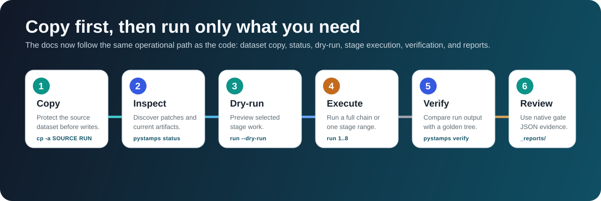
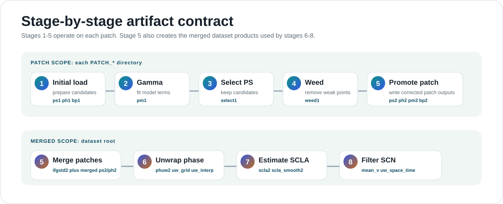

[](https://github.com/sirbastiano/pystamps/actions/workflows/wheels.yml)

<div align="center">
  

  <h1>pySTAMPS</h1>
  <p>Python-first StaMPS-style InSAR processing with a native Rust execution path, staged artifact checks, and deterministic verification.</p>

  <p>
    <a href="https://sirbastiano.github.io/pystamps/">Documentation</a> |
    <a href="https://sirbastiano.github.io/pystamps/quickstart.html">Quick Start</a> |
    <a href="https://sirbastiano.github.io/pystamps/stages.html">Stages</a> |
    <a href="https://sirbastiano.github.io/pystamps/native-cli.html">Native Rust CLI</a>
  </p>
</div>



## What It Does

pySTAMPS runs StaMPS-style stages over a writable dataset directory. It discovers `PATCH_*` folders, infers existing progress from MAT artifacts, runs only the selected stage range, and can verify generated outputs against a golden dataset.

The normal workflow is:

1. Copy the source dataset to a writable run directory.
2. Inspect current progress with `pystamps status`.
3. Preview writes with `pystamps run --dry-run`.
4. Execute a full chain or focused stage range.
5. Verify run artifacts against a reference dataset.

## Install

From a source checkout:

```bash
git clone git@github.com:sirbastiano/pystamps.git
cd pystamps
make deps
uv run pystamps describe-backends
```

For a fresh Ubuntu VM, install system build dependencies first:

```bash
make deps-ubuntu
make deps-check
```

Required local tools for source/native development:

- Python 3.12 or newer
- `uv`
- Rust through `rustup`, including `rustfmt` and `clippy`
- C/C++ build tools, `curl`, `pkg-config`, and Python development headers

Wheel installs expose the bundled native executable when available:

```bash
python -m pip install pystamps-insar
pystamps-native coverage --start-step 1 --end-step 8
```

## First Run

Always run on a copy because pySTAMPS writes stage artifacts into the dataset tree.

```bash
export SOURCE_DATASET=/path/to/original_dataset
export RUN_DATASET=/path/to/run_dataset

rm -rf "$RUN_DATASET"
cp -a "$SOURCE_DATASET" "$RUN_DATASET"

uv run pystamps status --dataset "$RUN_DATASET"
uv run pystamps run --dataset "$RUN_DATASET" --start-step 1 --end-step 8 --dry-run
uv run pystamps run --dataset "$RUN_DATASET" --start-step 1 --end-step 8
```

Run one stage by narrowing the range:

```bash
uv run pystamps run --dataset "$RUN_DATASET" --start-step 6 --end-step 6
```

If expected artifacts already exist, the result reports `skipped_existing`. Use a run copy that still needs the target outputs when you want to execute or benchmark a stage.

## Native Rust Path

Build the standalone native runner:

```bash
cargo build --release -p pystamps-core --bin pystamps-native
```

Run the full native chain:

```bash
target/release/pystamps-native run \
  --native-only \
  --dataset "$RUN_DATASET" \
  --start-step 1 \
  --end-step 8 \
  --backend native \
  --stage2-kernel-backend native \
  --cpu-workers 0 \
  --stage2-native-threads 0
```

`0` worker values mean "use the CPUs visible to this process." Set positive values to cap resources.

## Stage Map



Detailed stage descriptions, code paths, artifacts, and direct native commands live in [`docs/stages.html`](docs/stages.html).

## Verification

Compare a run directory against a golden dataset:

```bash
uv run pystamps verify --run "$RUN_DATASET" --golden /path/to/reference_dataset
```

Run the full native validation gate:

```bash
cargo build --release -p pystamps-core --bin pystamps-native
make native-full-chain-verify
```

Override paths and CPU limits when reproducing on a VM:

```bash
make native-full-chain-verify \
  DATASET=/path/to/source_dataset \
  GOLDEN=/path/to/reference_dataset \
  RUN=/path/to/clean_run_dataset \
  THREADS=8
```

The gate writes reports under `RUN/_native_gate_reports/`.

## Documentation

- [Documentation home](docs/index.html)
- [Quick Start](docs/quickstart.html)
- [Stages and Code Paths](docs/stages.html)
- [Pipeline and Science Guide](docs/pipeline-science-guide.html)
- [Native Rust CLI](docs/native-cli.html)
- [Architecture](docs/architecture.html)
- [Configuration](docs/configuration.html)
- [Verification](docs/verification.html)
- [Function Reference](docs/function-reference.html)

## Development Gates

```bash
cargo test --workspace
uv run pytest -q tests/test_kernels_accelerated.py
make native-full-chain-verify
```

Use `make web` when changing `crates/pystamps-web`. Use `make build` only for packaging work and avoid committing generated `dist/` artifacts during normal implementation.
