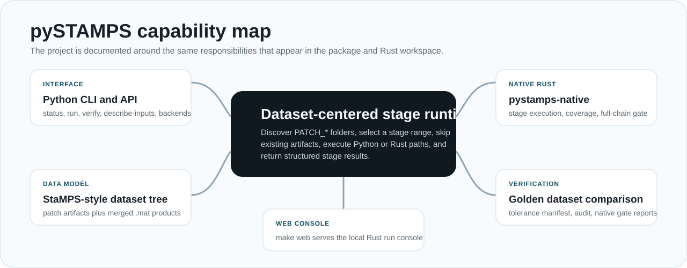

# Architecture Snapshot

pySTAMPS is organized around one invariant: a StaMPS-style dataset directory is the source of truth. The CLI, runtime scheduler, ported stages, optimized kernels, and verification tools all read from or write to that directory.

For the full teaching guide, read [pipeline_science_guide.md](pipeline_science_guide.md). For stage-by-stage implementation entrypoints, read [stages.md](stages.md).



## Runtime layers

| Layer | Main modules | Responsibility |
| --- | --- | --- |
| CLI | `pystamps.cli` | Parse commands, load config, print JSON reports |
| Configuration | `pystamps.config` | Normalize runtime, kernel, tolerance, tool, and compatibility settings |
| Dataset I/O | `pystamps.io.dataset`, `pystamps.io.mat` | Discover patches and read/write MATLAB-compatible artifacts |
| Pipeline orchestration | `pystamps.pipeline.stages` | Select stages, skip existing artifacts, schedule patch or merged work |
| Scientific stages | `pystamps.pipeline.ported` | Implement StaMPS-style stage behavior in Python |
| Kernels | `pystamps.kernels` | Dispatch hot numerical kernels to Python, native Rust/CPU, or CUDA providers |
| Runtime execution | `pystamps.runtime` | Provide hybrid thread/process execution primitives |
| Native Rust core | `crates/pystamps-core` | Own native dataset planning, full-stage execution driver, coverage matrix, and CLI entrypoint |
| MAT artifact I/O | `crates/pystamps-mat` | Write MATLAB v5 artifacts from Rust-owned stage code |
| Native stage registry | `crates/pystamps-stages` | Track stage-scope ownership and parity certification status |
| Parity harness types | `crates/pystamps-parity` | Share comparison result records between future Rust/Python parity runners |
| HTML frontend | `crates/pystamps-web` | Serve the local Rust execution console, submit runs, and expose `/api/native-coverage` |
| Verification | `pystamps.verify`, `scripts/validate_audit.py` | Compare run outputs against golden datasets and audit manifests |

## Pipeline model

Stages mirror the StaMPS stage range 1 through 8.

| Stage | Scope | Pipeline name | Expected progress artifact |
| --- | --- | --- | --- |
| 1 | patch | Initial load | `PATCH_*/ps1.mat` |
| 2 | patch | Estimate gamma | `PATCH_*/pm1.mat` |
| 3 | patch | Select PS pixels | `PATCH_*/select1.mat` |
| 4 | patch | Weed adjacent pixels | `PATCH_*/weed1.mat` |
| 5 | patch and merged | Correct phase and merge | `PATCH_*/ph2.mat`, root `ifgstd2.mat` |
| 6 | merged | Unwrap phase | root `phuw2.mat` |
| 7 | merged | Calculate SCLA | root `scla2.mat` |
| 8 | merged | Filter SCN | root `uw_space_time.mat` |

Patch-scoped stages run once per discovered `PATCH_*` directory. Merged stages run once at the dataset root. Stage 5 has both patch promotion and merged aggregation behavior.

For the code path behind each stage, see [stages.md](stages.md).

## Artifact-driven scheduling

Before running a stage, `pystamps.pipeline.stages` checks the expected artifact or stage bundle. If the artifacts already exist, the result status is `skipped_existing`. This makes the pipeline resumable and safe for inspection, but it also means benchmark or backend experiments must use a dataset copy that actually needs the target outputs.

The normal stage result statuses are:

| Status | Meaning |
| --- | --- |
| `planned` | Dry-run selected the stage but did not execute it |
| `completed` | Stage executed or strict reference replay copied the expected bundle |
| `skipped_existing` | Expected artifacts were already present |
| `skipped` | No artifact mapping exists for that scope |
| `failed` | Stage raised an execution error |

## Backend and kernel architecture

pySTAMPS separates runtime scheduling from numerical kernel selection.

Runtime backend values:

- `auto`: choose a practical scheduling mode by stage
- `threads`: use the I/O-oriented path
- `processes`: use CPU process workers where appropriate
- `gpu`: keep GPU-capable work in-process
- `native`: prefer CPU-oriented scheduling

Kernel backend values:

- `python`: reference NumPy/Python implementation
- `native`: compiled Rust/CPU implementation
- `cuda`: CuPy/CUDA implementation where registered and available
- `auto`: prefer optimized available providers with fallback rules

Current optimized kernel names are:

- `stage2_grid_accumulate`
- `stage2_histogram`
- `stage2_topofit`
- `stage2_topofit_row_invariant`
- `stage2_topofit_coh_row_invariant`
- `stage4_edge_stats`
- `stage7_scla`
- `stage8_edge_noise`

Inspect local availability with:

```bash
uv run pystamps describe-backends
```

The local Rust web console starts with:

```bash
make web
```

It serves `http://127.0.0.1:8787`. Dry-run planning uses `pystamps-core` directly.
Full execution is submitted through `pystamps-core` via the Python compatibility wrapper so JSON
report semantics stay stable.

`pystamps-core` includes two separate verification concepts:

- Rust driver coverage: the selected stage chain can be planned or launched from Rust.
- Full native stage coverage: every selected stage/scope has Rust-owned stage semantics and parity certification.

Inspect current native coverage from the Rust CLI:

```bash
cargo run -p pystamps-core --bin pystamps-native -- coverage --start-step 1 --end-step 8
```

Stage execution is also routed through the Rust CLI:

```bash
cargo run -p pystamps-core --bin pystamps-native -- stage 1 --patch DATASET/PATCH_1
cargo run -p pystamps-core --bin pystamps-native -- stage5-merge --dataset DATASET
```

That path writes MATLAB v5 artifacts directly from Rust for all Rust-owned stage scopes. As of this release,
coverage for stages 1 through 8 and the Stage-5 merged scope reports `native_stage=true` when enabled.
Coverage rows also include `parity_certified`, disabled-state metadata, unsupported native-only
execution modes, and a reason when a scope is not native-certified.

The full native verification gate is enforced in core via
`verify_full_native_processing_chain(start_step, end_step)`, which returns an error if any required
scope in the requested span is not `native_stage=true`.

The running web server exposes the current coverage matrix at `GET /api/native-coverage`.
The same payload format can be checked from CLI:

```bash
curl http://127.0.0.1:8787/api/native-coverage | jq '.[0:3]'
```

Example payload object shape:

```json
{
  "stage": 2,
  "scope": "patch",
  "target": "PATCH_1",
  "rust_driver": true,
  "native_stage": true,
  "parity_certified": true,
  "disabled": false,
  "unsupported_modes": [
    {
      "mode": "python",
      "reason": "native-only mode accepts only Rust-owned stage execution; Python is limited to verifier and reference tooling"
    }
  ],
  "native_kernels": [
    "stage2_grid_accumulate",
    "stage2_histogram",
    "stage2_topofit",
    "stage2_topofit_row_invariant",
    "stage2_topofit_coh_row_invariant"
  ],
  "details": "Stage 2 patch coherence estimation is native for MAT artifact loading, CLAP grid preparation/checkpoint writes, iterative weighting, topofit-compatible output variables, and synthetic parity coverage."
}
```

## Config flow

`pystamps --config CONFIG.yaml ...` loads a YAML or JSON config into `RunConfig`.

Common runtime fields:

```yaml
runtime:
  backend: auto
  stage2_kernel_backend: native
  stage2_native_threads: 0
  kernel_backend_overrides:
    stage2_grid_accumulate: native
    stage2_histogram: native
    stage2_topofit: native
    stage2_topofit_row_invariant: native
    stage2_topofit_coh_row_invariant: native
    stage4_edge_stats: native
    stage7_scla: native
    stage8_edge_noise: native
  io_workers: 8
  cpu_workers: 0
  stage7_chunk_ps: 100000
  stage8_chunk_edges: 200000
```

`cpu_workers: 0` means use the detected CPU budget. `stage2_native_threads: 0` lets native stage-2 execution use the configured CPU budget while avoiding patch-level oversubscription.

## Verification architecture

Single-run verification compares one run tree to one golden tree:

```bash
uv run pystamps verify --run RUN_DIR --golden GOLDEN_DIR
```

Full parity audit is handled by:

```bash
make audit
```

The audit dataset list is owned by `pystamps/data/audited_workflow_manifest.json`. Oracle precedence is owned by `pystamps/data/oracle_contract.json`. These files are the compatibility contract for broad parity claims.

## Practical boundaries

- The package implements stages 1 through 8 in `pystamps.pipeline.ported`.
- The optimized native extension accelerates selected hot kernels, not every line of the pipeline.
- `triangle` and `snaphu` are no longer required for the native Stage 6 path, but Python fallback
  remains available for non-native backends.
- Parity claims should come from `verify` + audited gate status, not from command success alone.
- Speed should be claimed from `make benchmark` or `scripts/benchmark_backends.py`, not from incomplete runs.
